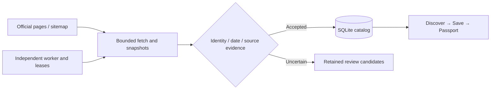

<div align="center">


# Concert Passport

**Find the show. Keep the night.**

Source-aware concert discovery and a private live-music journal for APAC K-pop fans.

[Live app](https://concert-passport.52-198-144-26.sslip.io) · [中文](README.md) · [Run locally](#run-locally) · [Contribute](CONTRIBUTING.md)

[](https://github.com/billpwchan/concert_passport/actions/workflows/ci.yml)
[](LICENSE)


</div>

> [!NOTE]
> **Early access.** Coverage is incomplete. A missing search result does not mean a concert does not exist. An official link is evidence of a destination, not available ticket inventory.

## From the next show to a night worth keeping

- Discover by artist, market, date and weekend. Explore the map and compare up to three performances.
- Check venue-local times, official destinations, source evidence and material changes. Conflicting times pause calendar export.
- Follow artists; save anonymously, then merge records into an account.
- Turn a saved past performance into an attendance record without duplicates. Add, edit, remove, restore and privately export memories as JSON.
- Web languages: English, Simplified Chinese, Traditional Chinese, Japanese and Korean.
- An independent SwiftUI / MapKit client and Swift lifecycle tests are included. [Native scope](apps/ios/README.md) differs from the Web.


<table>
  <tr>
    <td width="50%"></td>
    <td width="50%"></td>
  </tr>
</table>

Screenshots are dated **2026-09-30**, taken against an isolated acceptance environment. The [tour GIF](docs/assets/product-tour.gif) is a screenshot slideshow, not an interaction recording. Artist photography and posters retain their original rights; see [asset provenance](docs/ASSETS.md).

## Run locally

**Node.js 22.13+**, with Node 22 recommended and recorded in `.nvmrc`.

```bash
git clone https://github.com/billpwchan/concert_passport.git
cd concert_passport
npm ci --prefix apps/web
cp apps/web/.env.example apps/web/.env.local
npm run demo
```

Open **[localhost:3106](http://localhost:3106)**. Every demo run creates a fresh temporary database with explicitly fictional performances and starts no collector. Map tiles may still use the network.

For a normal, initially empty catalog, stop the demo and run `npm run dev` on port 3000. SQLite and media caches live in `apps/web/data/`. Set a random `INGESTION_CRON_SECRET` in `.env.local`, restart the app, then start a worker in another terminal:

```bash
cd apps/web
INTERNAL_APP_URL=http://localhost:3000 node --env-file=.env.local scripts/ingestion-worker.mjs
```

Root scripts delegate to the existing Web package; there is no second dependency tree or workspace migration. See the [development guide](docs/DEVELOPMENT.md) and [support](SUPPORT.md).

## No commercial API key required

The default `official` mode reads supported public promoter and venue pages, JSON-LD, public catalogs and explicitly published sitemaps. The collector uses host/path boundaries, robots checks, budgets, conditional requests, time/size limits and retry delays.



- Evidence timestamps for event facts, links and announcements are distinct.
- Ambiguous identities, date ranges and conflicting performance times remain review candidates.
- A source outage does not erase personal records or substitute fictional catalog data.
- The worker takes at most eight official pages per batch every five minutes by default. This is a scheduling cadence, not a whole-catalog freshness guarantee.

Ticketmaster, PredictHQ and Brave require explicit `hybrid` mode and valid credentials. Wikidata / Wikimedia supplement identity and attributable media; SearXNG is optional. See [keyless operations](docs/KEYLESS_DATA.md) and the [dated isolated audit](docs/observations/2026-09-30-keyless-collection.json). Run `npm run audit:sources` for a separate network audit.

## Technical shape

Next.js 16 App Router, React 19, TypeScript strict, Node `fetch`, Cheerio and `node:sqlite` with WAL and transactional migrations. MapLibre is loaded on demand; motion respects reduced-motion preferences. Dedicated editorial experiences use React Three Fiber / Three.js. SwiftUI and MapKit consume the API with separately tested domain semantics.

```text
apps/web/   Web, API routes, SQLite, collectors and tests
apps/ios/   SwiftUI client and Swift lifecycle core
deploy/     Portable Compose, existing host config and backup tooling
docs/       Current guides, provenance, dated observations and history
scripts/    Dependency-free repository checks
.github/    CI, Dependabot and contribution templates
```

The worker triggers authenticated internal HTTP jobs; the application owns persistent storage. The current architecture targets one application instance with durable disk. See [architecture](docs/ARCHITECTURE.md) and [API](docs/API.md).

## Deploy and verify

```bash
cp deploy/.env.example deploy/.env
# Generate the internal secret with openssl rand -hex 32.
# Configure your public HTTPS origin and reverse proxy.
docker compose --env-file deploy/.env -f deploy/compose.portable.yml up -d --build
```

Portable Compose binds loopback and uses persistent volumes. Use SQLite's backup API and a candidate database copy for upgrades. Follow the [deployment and rollback runbook](deploy/README.md).

```bash
npm run check
# Repository links/metadata, checker tests, Web tests, lint, types and build
cd apps/ios
swift test
```

CI builds against a temporary database. Source audits require network access and remain separate from deterministic tests. [Dated delivery evidence](docs/RELEASE_2026_09_30.md) states the verification boundaries.

## Contribute and follow

A replayable official-page fixture, timezone regression, translation improvement or accessible mobile interaction is a useful first contribution. Read [CONTRIBUTING](CONTRIBUTING.md), [community guidelines](CODE_OF_CONDUCT.md) and [SECURITY](SECURITY.md). Most detailed project documentation is currently in Chinese; issues and PRs may be in English or Chinese.

The [roadmap](docs/ROADMAP.md) prioritizes evidence quality, conflict review, freshness, personal records and native persistence. Notifications, billing, public personal sharing and complete coverage remain future work. There is no automatic ticket purchase.

Original code and documentation use the **[MIT License](LICENSE)**. Third-party media, logos, maps and source content retain separate conditions in [THIRD_PARTY_NOTICES](THIRD_PARTY_NOTICES.md).

If this is useful to you, **Star** the repository and **Watch → Releases** for meaningful updates. Share it with someone planning their next concert trip.
