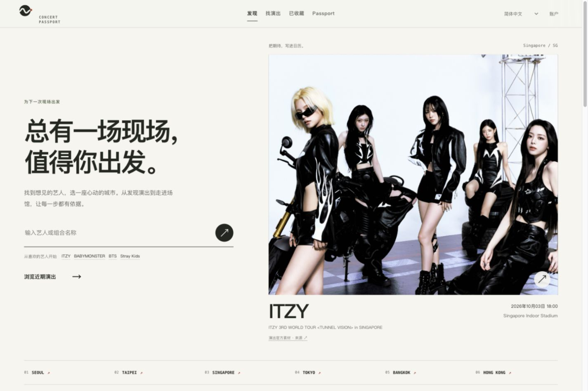
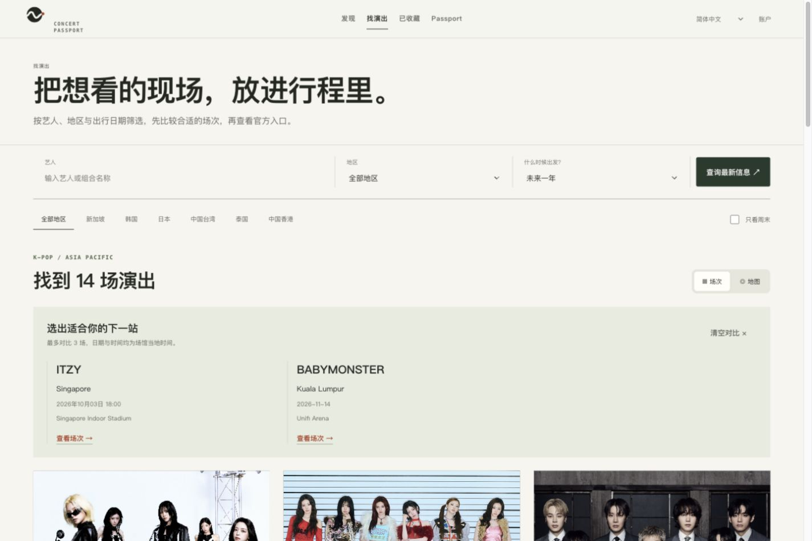
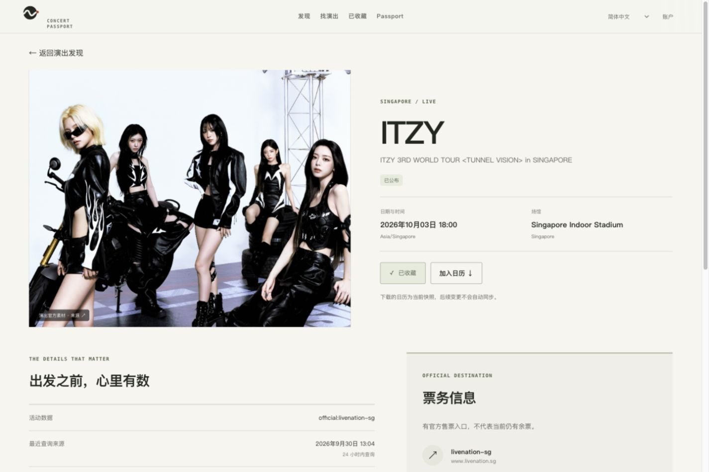
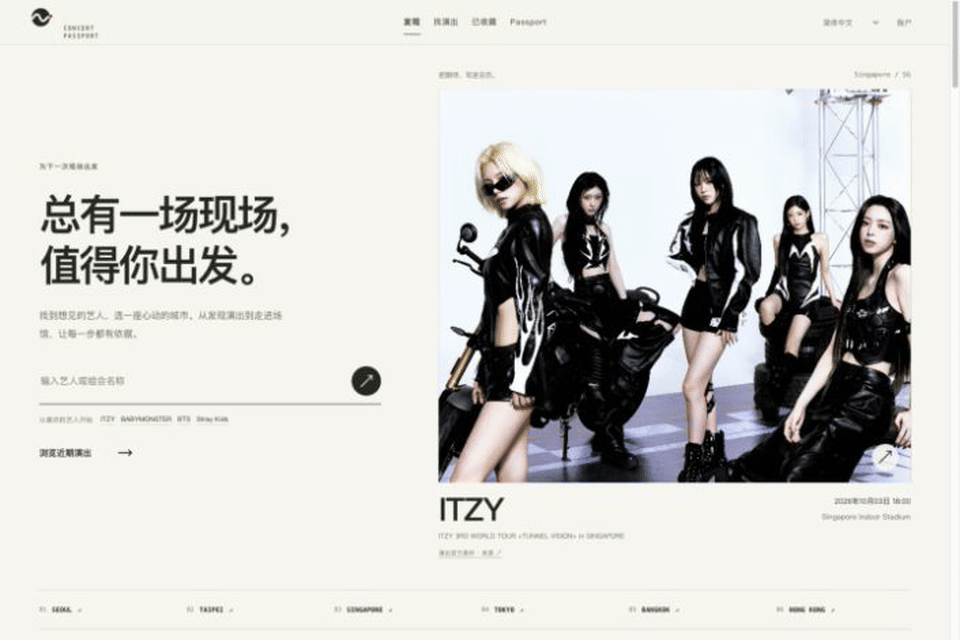
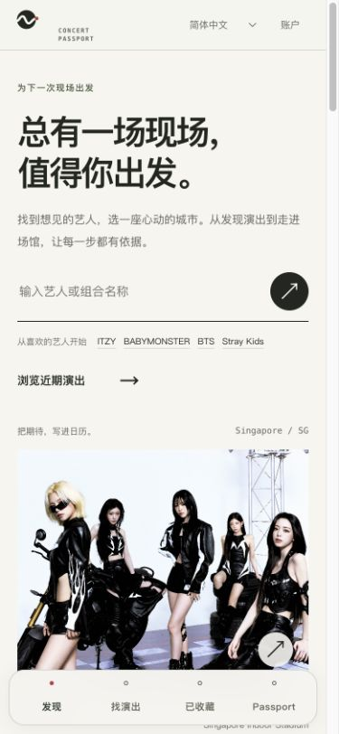
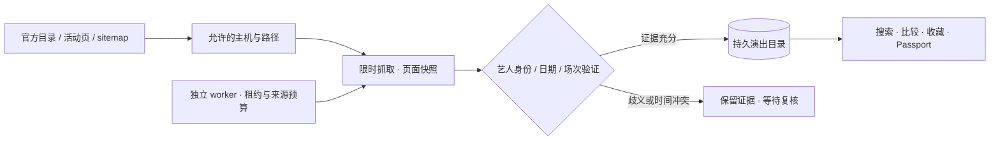

<div align="center">


# Concert Passport · 演出护照

**面向亚太 K-pop 观众的演出发现与私人现场档案。**<br />
从下一场演出，到值得留住的一晚。

[在线体验](https://concert-passport.52-198-144-26.sslip.io) · [本地体验](#本地体验) · [技术设计](#值得研究的技术设计) · [参与贡献](CONTRIBUTING.md) · [English](README.en.md)

[](https://github.com/billpwchan/concert_passport/actions/workflows/ci.yml)
[](LICENSE)


</div>

> [!NOTE]
> **Early access · 可以运行，也诚实呈现覆盖缺口。** 演出信息来自支持的官方公开来源，目录尚不完整。没有搜到不等于没有演出；官方链接也不代表仍有余票。

## 从「想去」到「去过」

巡演公告散落在主办方、场馆和售票网站里。同一场可能出现不同时间，跨城计划又要反复核对时区。看完以后，那一晚也值得拥有一个比过期二维码更长久的位置。

演出护照把这条路径连起来：

| 发现下一场 | 决定去哪一场 | 保存这一晚 |
| :--- | :--- | :--- |
| 按艺人、地区、日期与周末筛选 | 地图浏览，最多三场并排比较 | 匿名收藏，登录后合并个人记录 |
| 关注喜欢的艺人并管理关注列表 | 场馆当地时间、官方入口与来源依据 | 历史收藏一键转为出席记录 |
| 看清数据最近何时核验 | 时间冲突提示，确定后再导出日历 | 补录、编辑、移除、撤销与私人 JSON 导出 |

**Web 支持简体中文、繁體中文、English、日本語、한국어。** 仓库还包含 SwiftUI + MapKit 客户端和独立的 Swift 核心测试；[原生端的当前范围](apps/ios/README.md)与 Web 有所不同。

## 看看实际界面



<table>
  <tr>
    <td width="50%"><br /><strong>城市之间，找到值得出发的一场。</strong></td>
    <td width="50%"><br /><strong>每个决定，都能回到来源。</strong></td>
  </tr>
</table>

<details>
<summary><strong>展开页面导览与移动端截图</strong></summary>





</details>

截图来自 **2026-09-30** 的隔离验收环境；数据会变化，图片不是当前售票状态的证明。演出摄影与海报属于相应权利人，见[素材来源](docs/ASSETS.md)。顶部票根是本仓库原创 SVG 品牌插画。

## 本地体验

准备 **Node.js 22.13+**，推荐 Node 22；根目录的 `.nvmrc` 可供 nvm 使用。

```bash
git clone https://github.com/billpwchan/concert_passport.git
cd concert_passport
npm ci --prefix apps/web
cp apps/web/.env.example apps/web/.env.local
npm run demo
```

打开 **[localhost:3106](http://localhost:3106)**，直接体验发现、收藏与 Passport。演示每次创建独立临时数据库，使用标注为虚构的场次，不启动采集。地图底图仍可能请求公网。

<details>
<summary><strong>开发真实目录：启动 Web 与独立采集 worker</strong></summary>

停止演示服务，在仓库根目录启动：

```bash
npm run dev
# http://localhost:3000
```

普通模式从空目录开始；SQLite 和媒体缓存保存在 `apps/web/data/`。在 `apps/web/.env.local` 的 `INGESTION_CRON_SECRET` 填入随机值（可用 `openssl rand -hex 32` 生成），重启 Web，然后另开终端：

```bash
cd apps/web
INTERNAL_APP_URL=http://localhost:3000 node --env-file=.env.local scripts/ingestion-worker.mjs
```

首次采集需要时间，可在 `/sources` 查看最近检查、来源故障与积压。想验证真实来源而不影响本地目录，可在根目录运行 `npm run audit:sources`；它强制使用独立数据库，但会请求允许访问的公网来源。

</details>

<details>
<summary><strong>Docker 自部署</strong></summary>

```bash
cp deploy/.env.example deploy/.env
# 填写随机 INGESTION_CRON_SECRET；公网部署填写 HTTPS origin
# openssl rand -hex 32
docker compose --env-file deploy/.env -f deploy/compose.portable.yml up -d --build
```

通用模板绑定 `127.0.0.1:3000`，使用持久卷和独立 worker。公网访问需要 HTTPS 反向代理；升级前先做 SQLite 一致性备份。完整的启动、健康检查、备份与回滚见[部署指南](deploy/README.md)。

</details>

本仓库的网页代码是**有状态 Node 服务**：使用 `node:sqlite` 与后台任务，部署环境需要持久化磁盘。遇到问题先看[开发指南](docs/DEVELOPMENT.md)与[常见问题](SUPPORT.md)。

## 无密钥的数据，从哪里来？

默认 `official` 模式直接读取已接入的官方主办方与场馆公开页面，解析 JSON-LD、公开目录和明确公布的 sitemap。Live Nation 的多个亚太地区、ThaiTicketMajor、The Star 等入口都有对应配置或解析器；来源接入与当前覆盖量分别记录。



- **来源可以追溯。** 页面快照、场次版本与链接证据分别保留；活动事实、链接、价格公告有各自的检查时间。
- **不确定性有位置。** 艺人歧义、多日范围和近邻时间冲突进入复核；冲突场次暂停日历导出。
- **更新有预算。** 遵循 robots、请求配额、条件请求、`Retry-After` 与失败退避；临近演出和已知开售窗口优先。
- **数据故障与个人记录分开。** 来源不可用会显示降级，收藏和现场回忆继续保留。

worker 默认每 **5 分钟**取一批、最多 **8 页**。这是任务调度频率，每个页面还有自己的到期时间；不等于全目录每 5 分钟核验一次。[真实采集报告](docs/observations/2026-09-30-keyless-collection.json)公开保留结果与失败。

Ticketmaster、PredictHQ 与 Brave 属于可选商业连接器；只有显式选择 `hybrid` 并配置有效凭证才启用。Wikidata / Wikimedia 补充艺人身份与有出处的图片；SearXNG 是可选的私有搜索服务。详见[无密钥数据管线](docs/KEYLESS_DATA.md)。

## 值得研究的技术设计

这是一个能自部署的完整产品，也是一个可以逐层阅读的工程项目。

| 设计 | 解决的具体问题 | 从这里读代码 |
| :--- | :--- | :--- |
| **SQLite + WAL + 事务迁移** | 在小型主机上持久保存账号、收藏、目录和队列；迁移保留既有数据 | [数据库入口](apps/web/db/index.ts) · [版本迁移](apps/web/db/migrations.ts) |
| **持久队列与独立任务租约** | 重启后继续采集，各类任务独立退避，避免重复并发执行 | [采集队列](apps/web/db/collection.ts) · [调度控制](apps/web/db/scheduler.ts) |
| **证据驱动的发布边界** | 同名艺人、日期范围、官方入口与冲突时间需要不同核验 | [身份与场次解析](apps/web/lib/collection/parser.ts) · [链接校验](apps/web/lib/sources/link-resolution/trusted-sources.ts) |
| **匿名到账号的记录合并** | 先收藏再注册，合并个人状态，并隔离不同用户 | [账号与会话](apps/web/db/auth.ts) · [Passport 流程测试](apps/web/tests/passport-workflow.test.ts) |
| **时区与出席状态** | 场馆当地时间与绝对时间保持一致，重复确认不会重复记入档案 | [日历契约](apps/web/lib/domain/calendar.ts) · [业务测试](apps/web/tests/discovery-experience.test.ts) |
| **可信素材与渐进交互** | 活动图需要来源；地图按需加载，动效支持减少运动偏好 | [媒体管线](apps/web/lib/sources/media/index.ts) · [地图](apps/web/components/concert-map.tsx) |

<details>
<summary><strong>技术栈与目录地图</strong></summary>

| 层 | 当前实现 |
| :--- | :--- |
| Web | Next.js 16 App Router、React 19、TypeScript strict |
| 视觉与地图 | CSS Modules / Tailwind CSS 4、Motion、MapLibre GL；独立专题使用 React Three Fiber / Three.js |
| 数据与采集 | Node `fetch`、Cheerio、`node:sqlite`、事务迁移、持久调度 |
| 原生 | SwiftUI、MapKit、Swift 6 Foundation 核心 |
| 运维 | 多阶段 Docker、独立 worker、健康探针、SQLite backup API |
| 质量 | Node 内置测试、Swift Testing、ESLint、TypeScript、仓库文档检查、GitHub Actions |

```text
concert_passport/
├── apps/
│   ├── web/       页面、API、数据库、采集器与 Web 测试
│   └── ios/       SwiftUI 客户端与 Swift 核心测试
├── deploy/        通用 Compose、现有主机配置、备份工具
├── docs/          当前指南、素材来源、实测与历史决策
├── scripts/       无额外依赖的仓库质量检查
└── .github/       CI、Dependabot、Issue 与 PR 模板
```

Web 与 iOS 通过 API 对接，业务语义分别实现与测试。当前推荐单个应用实例与持久磁盘；横向扩容前需要重新设计数据库与队列边界。见[架构说明](docs/ARCHITECTURE.md)。

</details>

## 验证与参与

在仓库根目录运行完整 Web 与仓库检查：

```bash
npm run check
# 文档/素材链接、工程元信息、仓库检查器测试
# Web 单元与业务测试、ESLint、TypeScript、生产构建

cd apps/ios
swift test
```

测试使用合成数据和隔离数据库；CI 的生产构建也使用临时路径。公网来源审计是单独的、需要网络的检查。验证范围与现有部署证据见[交付记录](docs/RELEASE_2026_09_30.md)。

**第一次贡献，可以从一个很小但有价值的改动开始：**

| 你擅长 | 可以贡献 | 对应入口 |
| :--- | :--- | :--- |
| 数据与解析 | 一个可重放的官方页面 fixture、日期/身份边界修复 | [来源测试](apps/web/tests/fixtures/collection) · [来源建议模板](https://github.com/billpwchan/concert_passport/issues/new?template=source_request.yml) |
| 多语言 | 中、英、日、韩文案与格式一致性 | [语言目录](apps/web/lib/i18n/catalog) · [本地化约定](docs/LOCALIZATION.md) |
| 前端与设计 | 长艺人名、键盘导航、小屏与减少运动模式 | [Web 组件](apps/web/components) · [开发指南](docs/DEVELOPMENT.md) |
| 工程与运维 | 迁移验证、来源故障隔离、备份恢复说明 | [业务测试](apps/web/tests) · [部署指南](deploy/README.md) |

提交前读[贡献指南](CONTRIBUTING.md)。Bug、功能建议和数据来源都有 Issue 表单；社区交流遵循[行为准则](CODE_OF_CONDUCT.md)，漏洞走[安全报告](SECURITY.md)。

## 接下来的方向

近期优先提升**来源与字段证据、冲突复核、目录新鲜度**，再完善**个人档案、原生端持久状态与安全分享**。通知投递、付费订阅和更广市场覆盖仍待实现与验证；当前没有自动购票。每项工作以[路线图中的验收条件](docs/ROADMAP.md)为准。

| 想了解 | 入口 |
| :--- | :--- |
| 项目与上手 | [文档导航](docs/README.md) · [开发指南](docs/DEVELOPMENT.md) · [常见问题](SUPPORT.md) |
| 架构与 API | [架构](docs/ARCHITECTURE.md) · [API](docs/API.md) · [数据管线](docs/KEYLESS_DATA.md) |
| 维护与发布 | [更新记录](CHANGELOG.md) · [发布流程](docs/RELEASING.md) · [部署](deploy/README.md) |
| 展示与传播 | [项目展示资料](docs/SHOWCASE.md) |

## 许可证与致谢

本仓库原创代码与文档采用 **[MIT License](LICENSE)**。第三方照片、海报、Logo、地图和来源内容遵循各自条件，详见[素材清单](docs/ASSETS.md)与[第三方说明](THIRD_PARTY_NOTICES.md)。

感谢 Next.js、React、SQLite、MapLibre、Cheerio、Wikidata / Wikimedia、MusicBrainz 及所有为公开演出信息提供可靠入口的维护者。每次来源修复、翻译和小屏改进，都会让下一次出发更容易。

<div align="center">

**Find the show. Keep the night.**

觉得值得研究，欢迎 **Star**；想跟进更新，可 **Watch → Releases**。<br />
如果你认识也在跨城追现场的人，把演出护照分享给他们。

[在线体验](https://concert-passport.52-198-144-26.sslip.io) · [提交反馈](https://github.com/billpwchan/concert_passport/issues/new/choose) · [开始贡献](CONTRIBUTING.md)

</div>
