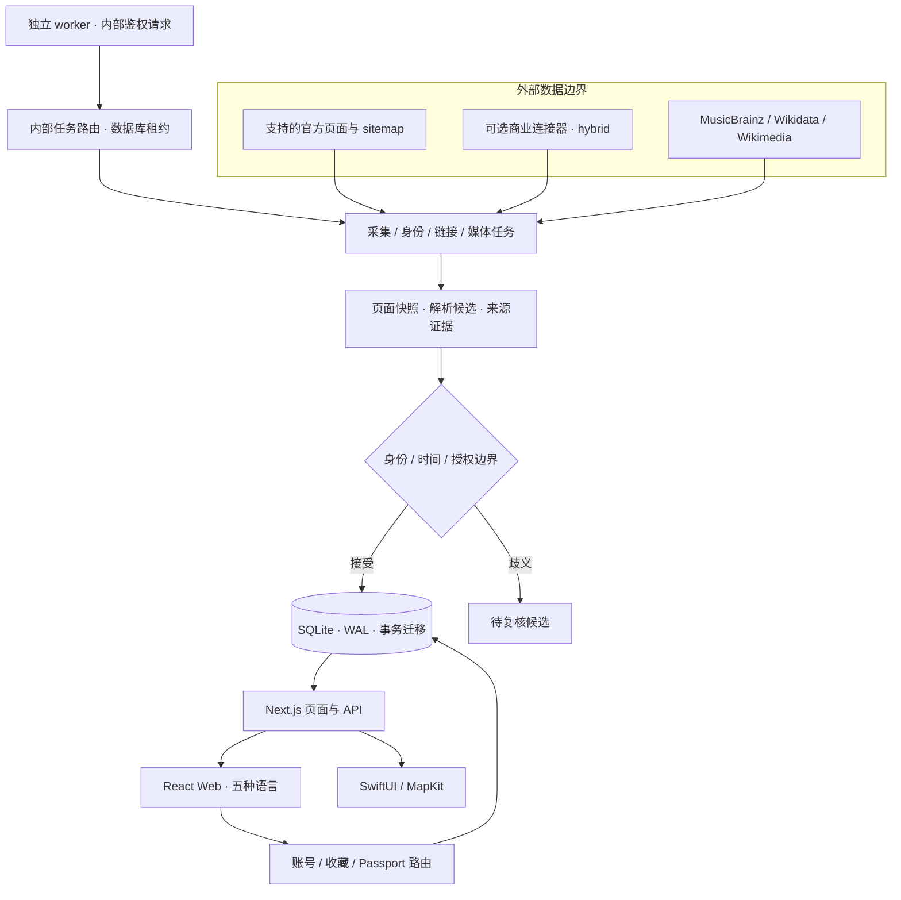

# 当前架构

Concert Passport 是一个模块化 monorepo：Next.js Web / API 与 SQLite 有状态服务、独立调度 worker，以及通过 API 读取数据的 SwiftUI 客户端。核心用户路径是发现 → 收藏 → 出席 → 私人 Passport；领域中仍保留 `ConcertJourney` 与票务里程碑语义。

## 运行与持久化

[Web](../apps/web/package.json)使用 Node 22、Next.js 16 App Router、React 19 与 TypeScript strict。Server Components 读取持久目录，Client Components 管理筛选、地图和用户动作；Route Handlers 处理查询、输入验证、会话、用户隔离与 mutation。

[数据库入口](../apps/web/db/index.ts)使用 `node:sqlite`，启用 WAL、foreign keys 与 busy timeout。[事务迁移](../apps/web/db/migrations.ts)按版本幂等运行。账号/会话、canonical events、来源关系、场次版本、采集 frontier、候选、媒体证据和个人记录由同一应用服务管理。

worker 与 Web 共用镜像，但通过内部 HTTP 请求发起任务，通用 Compose 中 **worker 不直接挂载数据库卷**。应用的持久卷保存 SQLite 和媒体缓存；Next 运行时缓存使用独立卷。当前推荐单应用实例，不把 SQLite 的持久租约等同于多实例分布式数据库。

通用模板绑定主机 loopback，由部署者配置 HTTPS 反向代理。现有 Lightsail 配置使用私有容器网络与共享 Caddy 网关。两者路径与网络不同，详见[部署指南](../deploy/README.md)。

## 官方采集与 hybrid 边界

默认 `official` 模式只运行支持的公开官方来源路径。持久 frontier 包含明确 seed、允许主机与路径，抓取前核验 robots，使用请求预算、超时、大小限制、条件请求和来源/页面退避。

抓取结果先成为页面快照和解析候选，再经艺人身份、市场、场馆日期与冲突检查进入 canonical 目录。来源暂时消失不推断取消；多日公告不被猜成多个确切开场时间；陌生或歧义艺人保留为候选。官方链接还需活动级匹配，可信域名本身不是授权证明。

独立 worker 分别调度官方采集、艺人身份、链接解析、媒体刷新和可选商业 ingestion；数据库租约避免同任务重入。临近演出、已知开售窗口和被关注艺人影响队列优先级，但来源公平与请求预算仍生效。批次间隔、页面到期、任务完成和字段核验是不同概念。

只有显式 `hybrid` 且凭证有效时才启用 Ticketmaster / PredictHQ / Brave。商业连接器保留稳定 attraction ID、共享限流门、市场/日期分片和 PredictHQ change feed；取消与删除不从一次搜索缺失推断。主采集与商业故障独立，缺少 key 不替换成演示数据。

搜索服务读取持久 canonical 目录，并带有连接器查询缓存。`hybrid` 中可触发可选连接器查询；默认官方页面 frontier 不由每次用户搜索同步遍历。细节见[当前数据管线](KEYLESS_DATA.md)与[来源集成契约](SOURCE_INTEGRATION_SYSTEM.md)。

## 身份、证据、时间

MusicBrainz / Wikidata 补充艺人外部 ID 与多语言别名。启动艺人名单是 bootstrap，不代表完整 K-pop 身份库。候选的身份、活动事实和媒体分别核验；身份数据不能证明演出时间。

演出保留绝对时间与 IANA 场馆时区；报名截止、开售、抽选结果、付款、交付、入场、开演可为独立里程碑。日期未确认或存在近邻时间冲突时，页面降低确定性，日历出口返回冲突，不能靠“最新抓取时间”自动选赢家。

活动事实 `data_verified_at`、链接 `best_link_verified_at`、价格公告 `observed_at` 和弱来源观察 `last_seen_at` 各有含义。活动版本记录物质变化，原始证据和待复核候选保留解释路径。

## 个人状态与安全

账号使用 salted scrypt；随机会话 token 在数据库内保存哈希，浏览器 cookie 为 HttpOnly，认证边界轮换会话。匿名浏览器身份可合并到登录账号，个人读写以服务端身份为边界。收藏转出席保持幂等，回忆支持编辑、移除、恢复与私人 JSON 导出。

内部任务使用服务端密钥鉴权并受数据库租约控制。来源与媒体 fetch 保留 SSRF / 重定向边界；用户 mutation 验证同源与所有权。项目不保存支付卡、卖方凭证、身份证件、条码或票据 PDF。未来公开分享需要独立隐私投影，不能直接暴露私人记录。

## 客户端与渐进交互

Web 支持五种语言。MapLibre 按需加载，使用 OpenFreeMap 样式；地图与列表并存，缺失准确场馆坐标时可显示明确标注的城市近似位置，来源见 [ASSETS](ASSETS.md#map-locations)。动效遵循减少运动偏好，独立 3D 专题与通用发现体验分开。

[iOS](../apps/ios/README.md)采用 SwiftUI、MapKit、Observation，目标 iOS 17+；Foundation 核心通过 Swift Package 独立测试。目前部分计划与示例记录在内存，移动端写入需专门设计账号/会话与离线持久化。Web cookie 不是完整移动认证协议，不能用内部任务密钥替代用户登录。

## 验证与下一步

CI 分别验证仓库文档/元信息、Web 业务/静态/生产构建、Swift 核心。实时官方来源审计使用隔离数据库并单独运行；健康探针的 `ready` 与采集 age 分开，HTTP 200 不保证每条目录已更新。

下一阶段需要字段级证据、冲突复核工具、候选保留策略与延迟观测；原生认证与持久状态；通知 transactional outbox 与实际投递；在多实例扩容前评估 PostgreSQL 和独立 durable queue。均按[路线图](ROADMAP.md)验收，不视为已实现功能。更详细的历史设计见[文档导航](README.md)。
