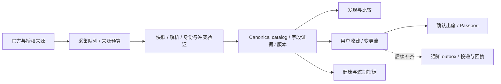

# Concert Passport：重构诊断与实施蓝图

日期：2026-09-30。阶段：第一步已完成；后续设计、业务重构与部署尚未实施。

本轮按「先从第一步开始」完成基线调查、产品收敛和文档入口整理。这里的建议用于下一阶段实施；历史文档是背景材料，不构成额外操作授权。现有未提交工作全部保留。

## 1. 方向：值得使用，也值得研究的演出护照

**帮助亚太 K-pop 粉丝找到可信的演出、比较值得去的城市，把想去和去过的现场留在同一本 Passport。**

对用户，价值是少翻几个网站、看清时间与来源、保存一场、留下真实记录。对开发者，吸引力来自可自部署的完整产品、可解释的数据管线、跨时区逻辑和高完成度互动设计。漂亮的截图能带来第一次访问，可运行、可维护、可贡献决定仓库能否长期积累关注。

保留 Next.js + SQLite 模块化单体、独立 worker 和原生 SwiftUI。Web 作为本轮体验与开源展示的主线；iOS 保持接口兼容，后续跟进视觉。暂不为炫技引入微服务、消息中间件或数据库迁移。

### 用户与增长假设

| 用户 | 核心任务 | 第一次有价值的结果 | 回访理由 |
| --- | --- | --- | --- |
| 跨城、跨国看 K-pop 的粉丝 | 同一艺人多城比选 | 找到日期合适、来源明确的一场并保存 | 已保存场次的变化、下一场发现 |
| 已有旅行安排的观众 | 在目的地和时间窗找演出 | 找到行程内可去的一场 | 旅行日期变化、再次出行 |
| 喜欢记录现场的观众 | 保存真实出席经历 | 从已保存演出生成一条 Passport 记录 | 年度回顾、收藏与分享 |
| 开源开发者与自部署用户 | 跑起来、看懂、扩展 | 无密钥也能启动并理解数据状态 | 新适配器、视觉模板、可复用工程能力 |

以上是产品假设，不是已验证的市场结论。先以 8–12 位目标用户验证搜索、比较、保存、回忆的行为；不以年龄或性别直接决定视觉。Bandsintown 已有艺人追踪与演出通知，因此单纯「发现 + 提醒」不足以证明差异化；这里选择跨城市决策、来源透明度和 Passport 作为待验证的切入点。[官方产品说明](https://artists.bandsintown.com/support/blog/what-are-trackers-and-how-do-fans-become-trackers)

## 2. 已核实的基线

### 代码与界面

- Web 已有搜索、最多三场比较、收藏及取消收藏、账号与匿名数据迁移、手动 Passport、来源状态、部分日期导出；五种界面语言已有目录。
- 已有持久化采集 frontier、来源快照、解析候选、艺人身份匹配、canonical events、版本记录、链接证据和媒体证据。不是从零开始的项目。
- `/api/v1/follows` 当前只有 GET/POST，Passport API 只有 POST；关注管理、Passport 修改与删除、收藏转出席、实际通知投递仍是重点缺口。
- `home-hub.tsx` 中推荐艺人是静态列表，传入的 `signedIn` 未参与渲染。首页个人化尚浅；不要把静态推荐描述为实时热度。
- 独立 ITZY 体验已有 Motion / React Three Fiber；通用演出页和专题页是两套路径。`spotlights.ts` 将日期、场馆与视觉配置放在一起，后续需要让业务事实回到 canonical 数据。
- 线上窄屏首页呈现大标题、搜索、静态演唱会图；首屏以下才是演出结果。当前可见内容有中英文混排。该观察不是完整的桌面、移动端和无障碍验收。
- `globals.css` 为 1,455 行，同时存在 `discovery.css` 和多套 CSS Modules；大型 DB 模块仍混合查询、合并与持久化。应按职责渐进拆分，避免只换目录名。
- CONTRIBUTING 仍提到 Drizzle 和 D1，实际使用 `node:sqlite`；本轮已修正文档。环境模板原本将本地数据指向 `/data`，本轮已改为项目内路径，并补充生产覆盖说明。

### 线上数据快照

来源：只读请求 [公开 coverage API](https://concert-passport.52-198-144-26.sslip.io/api/v1/coverage)。响应生成时间 **2026-09-30 12:42:06 +08:00**。统计会随采集变化，不是持续有效的宣传数字。

本次返回的指标与任务状态另存为[只读观察摘要](observations/2026-09-30-coverage.json)，便于后续比较；该文件不作为产品数据输入。

| 现有 API 指标 | 数值 | 正确解释 |
| --- | ---: | --- |
| upcoming | 86 | 当前查询范围内未取消、未删除、未隔离的未来记录 |
| withOfficialLink | 65 / 86 | `best_link_url` 非空，不等于链接此刻可用或仍有票 |
| checkedRecently | 9 / 86（10.5%） | `last_seen_at` 在最近 72 小时内，不等于每个字段均经过官方复核 |
| frontier.total | 550 | 已进入持久队列的 URL |
| frontier.due | 195 | 已到检查时间，可能包含主机退避或不可访问页面 |
| frontier.unseen | 7 | 尚无检查记录的页面 |
| needs_review | 2,954 | 待复核候选记录，不能解读成 2,954 场待发布演出 |

快照中 official_collection、event_ingestion、artist_catalog_sync 均为 `partial`；link resolution、media refresh 为 `completed`。多家 Live Nation 来源近期检查成功，部分售票页处于 blocked、authentication 或 unavailable 状态。这里的 authentication 是现有分类器结果：403 也会被归入该类，不能仅据此断言密钥失效。

线上首页同时出现 XLOV 新加坡 10 月 1 日 19:00 / 19:30、The Star Theatre / The Star Performing Arts Centre 两条记录。这是**疑似同场冲突**，需要原始来源、场馆身份和版本链核实。不得为了漂亮的数据自动删掉其中一条。

结论：任务在运行，演出级新鲜度仍有明显缺口。不能把「每 5 分钟运行」写成「全目录每 5 分钟更新」。

### 验证边界

| 检查 | 本轮结果 |
| --- | --- |
| Web 测试 | 98 / 98 通过 |
| ESLint、TypeScript、生产构建 | 通过；构建指向独立临时数据库 |
| Node 环境 | 本机 v26.7.0；仓库 CI / Docker 使用 Node 22，发布前还须在目标运行时验证 |
| iOS `swift test` | 本机缓存写入权限与 Swift/SDK 诊断阻止执行；未宣称通过 |
| 线上首页与公开 coverage | 已读取，未提交收藏、账号或纠错数据 |
| 主机 CPU、磁盘、镜像、备份恢复 | 本轮未 SSH 核实；历史发布记录不是当前状态证明 |

## 3. 视觉：把舞台、城市和个人收藏连起来

建议统一方向为 **「舞台光场 × 巡演地图 × 收藏票根」**。界面以近黑、暖白为底，保留易读的数据层，演出主色来自对应资产；避免每张卡片都使用同一套泛用渐变。

| 页面 | 主视觉与交互 | 必须完成的真实动作 |
| --- | --- | --- |
| 发现 | 舞台式开场、巨型艺人排版、巡演城市轨迹；新用户保留明显搜索 | 搜索并进入可信场次 |
| 找演出 | 日期滑动、城市地图与列表联动、最多三场可展开对比 | 以日期、时区、场馆和来源做选择 |
| 演出详情 | 视觉由海报与巡演主题驱动；灯光和图像分层；出票信息固定可见 | 保存、查看官方页、导出准确日历 |
| 已收藏 | 下一场票根、变更摘要、已结束待确认 | 从想去到真实出席 |
| Passport | 时间轴、城市足迹、年度统计、印章入册和分享成品 | 修改自己的记录并生成隐私可控分享 |

动效应该表达动作：保存时票根入夹、确认出席后印章落下、城市选择时路线重绘。3D 光场只在适合的专题使用，延迟加载、离屏暂停、低性能设备退化到静态；导航、搜索、购票入口保持迅速。保留原生滚动，支持键盘和 `prefers-reduced-motion`。

建议验收预算：移动端 LCP ≤ 2.5s、INP ≤ 200ms、CLS ≤ 0.1 作为目标，而非当前测量值；核心页面不因专题 3D 增加首屏依赖；390px 与 1440px、无图片、无结果、数据过期、长艺人名称都要可用。

图片分开管理：官方演出海报、许可明确的艺人照片、原创品牌背景、用户私有照片。每张资产记录来源、用途、许可状态、尺寸、裁切焦点和核验时间。来源可信与再分发许可是不同字段。主题不再匹配时回退品牌视觉，不能把上一轮巡演的图当作新场次海报。

## 4. 数据时效性：从任务频率到事实可信度

> 后续进展：用户确认不依赖有效商业 API key。默认 official 模式、官方场馆解析、失败隔离与开售窗口调度已落地，见[无密钥采集验收](KEYLESS_DATA.md)。本节其余基线仍为第一轮诊断时的观察。

### 当前实际调度

依据 `scripts/ingestion-worker.mjs`、`lib/collection/policy.ts`、`lib/collection/runner.ts`：

| 层级 | 当前行为 |
| --- | --- |
| worker 扫描 | 默认 60 秒检查一次到期任务；任务串行请求 |
| 官方采集批次 | 默认每 5 分钟请求；单批默认至多 8 页、循环预算 50 秒 |
| 普通页面 | 6 小时后再次到期 |
| 距演出少于 14 天 | 2 小时后再次到期 |
| 距演出少于 2 天 | 30 分钟后再次到期 |
| 历史页面 | 7 天后再次到期 |
| provider ingestion / 链接解析 | 默认 20 分钟请求 |
| 艺人目录 / 艺人媒体 | 默认 6 小时请求 |
| 搜索缓存 | 成功 10 分钟；存在来源错误时 1 分钟 |

这些是到期与请求间隔，不是完成保证。串行任务、重试、页面限制、主机冷却和候选审核都会延长延迟。按理想 8 页 / 5 分钟计算，上限约 96 页 / 小时，550 页完整轮转约 5.7 小时，尚未计网络耗时和失败。无法同时对全队列承诺半小时复核。

### 下一阶段实现

1. **分开记录四种时间**：`sourcePublishedAt`（源头实际公布，可空）、`fetchedAt`（请求成功）、`verifiedAt`（字段证据核验）、`changedAt`（事实变更）。现有 `last_seen_at` 仅保留其观察含义。
2. **按字段与事件阶段调度**：开售窗口不能只按演出日期提速。建议普通演出 6–12 小时；演出两周内 2 小时；已知开售前后两小时或重大冲突 5–15 分钟，仅在源站允许且预算足够时启用；稳定媒体 7–30 天；历史事件 7–30 天。均为待实现策略。
3. **给状态明确期限**：日期、场馆、开售时间分别记录证据；过期显示最后可信值与绝对核验时间。信息不可访问不自动等于取消，也不自动复活停售场次。
4. **调度优先级可解释**：已保存且接近开售的场次 → 临近演出 → 有冲突/变更 → 新发现 → 普通目录 → 历史。为每个来源保留公平额度，防止热门艺人吃光预算。
5. **失败分型**：401 凭证、403 拒绝访问、robots 禁止、429 配额、5xx、解析失败分开显示；尊重 Retry-After，退避加抖动，支持熔断与人工恢复。不要绕过访问限制。
6. **冲突进复核队列**：艺人 ID + 场馆 ID + 当地日期 + 来源性能标识共同判断；时间不同不能仅凭名字相近合并。优先处理下一周且有用户保存的冲突。
7. **可观测性与保留策略**：增加事件级过期率、允许抓取来源的 overdue 年龄分位数、最长未成功时长、解析发布率、失败原因、待复核年龄；候选去重/归档与媒体缓存容量也要受控。

建议先对可稳定访问来源建立 SLO，再逐步扩市场。全目录、已保存场次、临近开售场次分别显示分母；不要用健康来源百分比代替事件准确率。

Ticketmaster Discovery 文档列出的默认额度为每日 5,000 次、每秒 5 次；其 FAQ 存在不同的每秒速率表述，因此以实际 key 配额、响应头和最新平台说明为准。保留仓库已有的日预算和请求间隔约束，不通过提高全局轮询频率解决覆盖问题。[Discovery API](https://developer.ticketmaster.com/products-and-docs/apis/discovery-api/v2/)、[FAQ](https://developer.ticketmaster.com/support/faq/)

## 5. 后端重构边界

- 分离领域规则、应用服务、数据库仓储、来源适配器和表现层。先从时效性与收藏转 Passport 两条纵向链路开始，不一次搬动所有文件。
- 用现有 fixture 回放验证来源变化；领域纯函数用固定时钟覆盖当地日期、只有日期、取消/延期、同名艺人、时间冲突和重复提交。
- 收藏 → 出席通过事务和用户/场次唯一约束实现幂等；补齐取消关注、Passport 编辑/删除，并验证用户隔离。
- 变更流先落地，再引入通知 outbox、投递重试和幂等键；API 返回 200 不能当作实际提醒送达。
- SQLite 继续由 app 持有，worker 通过内部 API 调用；确认数据库写竞争、数据量或多实例需求后再评估 PostgreSQL。
- 增加轻量 liveness、数据库 readiness、worker freshness 三种健康判断。当前 Docker 用 `/api/v1/sources` 判断 app 健康，worker healthcheck 被关闭；两者不足以覆盖采集停摆。

## 6. 商业与高质量仓库

### 商业假设

免费层保留发现、可信来源、基础收藏、个人历史和导出。未来可为高级年度回顾、丰富分享模板、多城规划、经过验证的高级提醒提供托管订阅；提醒投递和数据服务尚未实现，不写成已可购买能力。

候选收入顺序：托管 Plus → 用户纪念品/印刷产品 → 获得授权后的旅行或票务推荐合作。订阅价格需要访谈和成本验证，旧文档中的美元年费不作为新版本定价。后期的 B2B 数据服务取决于实际数据权利和稳定性。

成本模型至少覆盖：服务器与备份 + 数据 API + 图片存储/带宽 + 通知 + 人工纠错。单用户贡献 = 净订阅收入 − 单用户可变成本；不能只看请求成本而忽略审核成本。早期追踪「找到并保存一场」「下次回来」「完成真实出席记录」，有投递系统以后才衡量提醒转化。

### README 与贡献体验

主 README 中文，先说明价值与真实能力，再给演示、启动、架构和贡献入口。独立英文 README 在界面与功能稳定后补齐。GitHub 官方建议 README 解释用途、价值、启动方式和获得帮助的入口，并使用仓库相对链接保证分支可携带性。[GitHub README 指南](https://docs.github.com/en/repositories/managing-your-repositorys-settings-and-features/customizing-your-repository/about-readmes)

视觉展示下一阶段采用：一个原创品牌主视觉、一个 10–15 秒真实交互演示、三张对应桌面/手机/Passport 的截图。动画使用 GitHub 可展示的媒体；页面交互放到演示站，不把 README 当成能执行网页脚本的页面。避免一屏 badge、假覆盖率、虚构用户和无法复现的截图。

仓库配套：许可证选择、SECURITY、issue/PR 模板、发布记录、配置表、可启动的本地 Compose、确定性的离线演示数据。演示数据必须显式隔离、标明样例；真实数据源不可用时不偷偷填入样例。

当前未找到仓库级 LICENSE。许可证由维护者在正式开放贡献前确定；资产许可独立记录，本轮不代替维护者授予新许可。保留有价值的历史文档，用目录标记「现状参考 / 历史探索 / 历史验收」，避免再增加相互矛盾的产品宣言。

## 7. 部署与恢复

现有仓库定义：Lightsail 上独立 app、worker、私有 SearXNG；仅 app 加入现有 `jchart_gateway`，由共享 Caddy 代理。生产状态位于 `/opt/concert-passport`。用户已授权最终部署，本轮仅做公开只读检查；没有读取或复制 PEM 内容。

发布前应只读核实：服务器架构、可用内存/磁盘、当前镜像与 release 指向、Caddy 配置、数据库体积与 schema、worker 最近成功、备份与恢复记录。不能仅凭 9 月 9 日报告认定现在依然健康。

推荐实施顺序：

1. 固定源代码快照与带版本镜像；现有未提交改动先记录归属和发布清单，避免用 `latest` 作为唯一回滚标识。
2. 在 CI 或匹配服务器架构的构建环境产出镜像，尽量不在小规格生产主机编译。
3. 对生产 SQLite 做一致性在线备份并执行 integrity check；不能只复制处于 WAL 写入中的主文件。将可恢复备份加密保存在另一故障域。
4. 使用生产备份的私有副本做候选迁移与用户表校验；候选 worker 关闭，避免抢占真实源站配额。绝不以本地预览数据库覆盖生产。
5. 验证空库启动、旧库升级、核心读写、权限隔离、日期导出和五语言页面；发布产物固定 Node 22 并重新验证。
6. 切换时暂停旧 worker、排空写请求、最终备份、运行兼容迁移、启动新 app，readiness 通过后切换路由，再启动唯一 worker。必要时接受短暂维护窗口。
7. 对可兼容的增量 schema，回滚镜像并保留数据库；破坏性迁移必须单独设计回退，不能简单恢复旧备份丢掉新写入。
8. 发布后检查演出级新鲜度与实际 worker 完成情况，观察 24–48 小时；页面返回 200 不是完整验收。

单机 SQLite 现阶段适用；不把同一数据库文件挂给两个同时接收写请求的版本冒充无风险蓝绿部署。建议备份目标先设为 RPO ≤ 24h、RTO ≤ 1h，再通过恢复演练确认，而非直接承诺。

## 8. 分阶段交付与验收

| 阶段 | 交付 | 进入下一阶段的条件 |
| --- | --- | --- |
| 01 · 本轮 | 代码/线上基线、中文 README、文档导航、启动配置纠偏、实施蓝图 | 事实、假设、未验证项分开 |
| 02 · 视觉主线 | 发现 → 演出详情 → 收藏的可运行新版；设计 token、资产清单、真实演示媒体 | 手机/桌面、空态/过期态、键盘/减弱动效通过；真实数据接通 |
| 03 · 数据与业务 | 字段级时效、冲突复核、调度优先级、关注管理、收藏转 Passport、编辑删除 | 来源回放、时间边界、幂等、数据隔离、旧库迁移通过 |
| 04 · 开源发布准备 | 中英 README、演示数据隔离、社区文件、版本发布、通用自部署说明 | 干净 clone 可按文档启动；声明与真实能力相符 |
| 05 · 生产发布 | 候选验收、备份恢复验证、版本部署、回滚演练、采集观察 | app/worker/数据指标通过；无用户数据丢失 |

下一步从阶段 02 的一条完整用户路径开始，同时把阶段 03 的新鲜度状态纳入组件契约。这样视觉改造不会在接入真实状态时返工，也能尽早得到可观看、可操作的成果。
